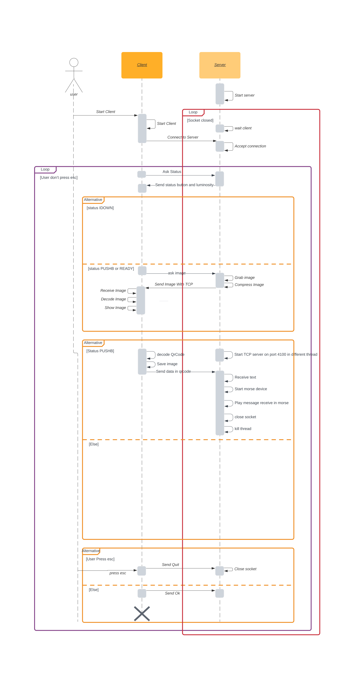

# ELE4205_Project 
 
[TOC]

This project has been realize in an educational context. 
The objectiv of this project is to realize and application composed by :

- Server : located on an SBC ([OdroidC2](https://www.hardkernel.com/shop/odroid-c2/))
- Client : located on the host computer

## Setup environnement 

To set up the environement execute the folowing command:
> git clone git@github.com:Tecnelm/Camera_Qrcode_crossplatform.git

Download poky odroid toolchain and install it.

You can also generate your toolchain with the build tool _Yocto_ (folowing instruction in LAB[1])

ℹ️ In case of non default path of pokytoolchain set **POKY_INSTALL_DIR** option in cmake see **build section**.. 
     
structure of poky_install_dir :

    .
    ├── environment-setup-aarch64-poky-linux
    ├── site-config-aarch64-poky-linux
    ├── sysroots
    │   ├── aarch64-poky-linux
    │   │   ├── bin
    │   │   ├── boot
    │   │   ├── dev
    │   │   ├── etc
    │   │   ├── home
    │   │   ├── lib
    │   │   ├── media
    │   │   ├── mnt
    │   │   ├── proc
    │   │   ├── run
    │   │   ├── sbin
    │   │   ├── sys
    │   │   ├── tmp
    │   │   ├── usr
    │   │   └── var
    │   └── x86_64-pokysdk-linux
    │       ├── environment-setup.d
    │       ├── etc
    │       ├── lib
    │       ├── sbin
    │       ├── usr
    │       └── var
    └── version-aarch64-poky-linux

### Dependencies

- Opencv _2.4_ on Client 
- Opencv _3.1_ on Server 
- Poky-odroid-toolchain 
- cmake _MINIMUM VERSION 3.12_
- build-essential 
- zbar
- c++ 11
- Qt5 or above

#### Build OpenCV 
You can follow this [link](https://gist.github.com/Tecnelm/fae22ae217672171c8e6aa50bf31b260) and make the necessary modification /!\ No support will be given. We assume that you know what you are doing.

#### Multiple package version use 
In case of wanting to build Server and client Target you will need to have OpenCV3.1 and OpenCV2.4 installed **at the same time** to provide this feature. Find pakage feature looking for name `<PackageName>[version]`. For example with OpenCv3.1 : library can be install in `/usr/local/OpenCv3.1`. 

### Build
    
    bash
    cd ele4205_projet_aut2022_29
    cmake   -DPOKY_INSTALL_DIR="<path/to/poky/odroid>"\
            -DUSE_CROSS_COMPILE_ODROID_POKY=ON\
            . -B build

    cmake --build build/
    
Executable will be located in `build/client/ELE4205_PROJECT_client` for the client.

Executable will be located in `build/server/ELE4205_PROJECT_server` for the server. 

### Cmake Option 

- `POKY_INSTALL_DIR` : Poky odroid installation sysroot . Default value : `/opt/poky/2.1.3/`
- `USE_CROSS_COMPILE_ODROID_POKY` : Option to set _ON_ or _OFF_ the cross compilation . Default value :`ON`  

### Run programm
 - Build executable 
 - plug in odroid
 - Mount connection 
 - use `local_deploy.sh` to send the server on odroid and start it 
 - create directory to save image. Name : **image**
 - Start client 
### Vscode 
#### Debugger
To help Debugging on VSCode we write two debugger launch Task:
- One remote 
- One local 

##### Local 

        {
            "name": "GDB local",
            "type": "cppdbg",
            "request": "launch",
            "program": "${command:cmake.launchTargetPath}",
            "args": [],
            "stopAtEntry": true,
            "cwd": "${workspaceFolder}",
            "environment": [],
            "externalConsole": false,
            "MIMode": "gdb",
            "setupCommands": [
                {
                    "description": "Enable pretty-printing for gdb",
                    "text": "-enable-pretty-printing",
                    "ignoreFailures": true
                }
            ]
        }
##### Remote 

        {
            "name": "GDB remote",
            "type": "cppdbg",
            "request": "launch",
            "program": "${command:cmake.launchTargetPath}",
            "args": [],
            "stopAtEntry": true,
            "cwd": "${workspaceFolder}",
            "environment": [],
            "externalConsole": false,
            "MIMode": "gdb",
            "targetArchitecture": "arm64",
            "preLaunchTask": "odroid-deploy-gdb",
            "setupCommands": [
                {
                    "description": "Enable pretty-printing for gdb",
                    "text": "-enable-pretty-printing",
                    "ignoreFailures": true
                },
                {
                    "description": "Set sysroot ",
                    "text": "set sysroot ${config:INFO.POKY_INSTALL_DIR}/sysroots/aarch64-poky-linux/"
                }
            ],
            "miDebuggerPath": "${config:INFO.POKY_INSTALL_DIR}/sysroots/x86_64-pokysdk-linux/usr/bin/aarch64-poky-linux/aarch64-poky-linux-gdb",
            "miDebuggerServerAddress": "${config:ODROIDC2.TARGET_IP}:${config:ODROIDC2.TARGET_PORT}",
        }
##### Known Issue

Due to implementation of vscode debugger using it with in crossplatform debugging cause a lot of delay. 
If your computer didn't "connection failed" to the device during the connection Gui could freeze 

#### Include 
To provide good include intellisense you need to add to your _c_cpp_properties.json_ the folowing line.

- `"configurationProvider": "ms-vscode.cmake-tools"`
- `"compileCommands": "${workspaceFolder}/build/compile_commands.json"`

#### Settings 

During the project we used the folowing setting in _settings.json_

    {
        "C_Cpp.clang_format_fallbackStyle": "WebKit",
        "cmake.sourceDirectory": "${workspaceFolder}",
        "cmake.buildDirectory": "${workspaceFolder}/build/",
        "C_Cpp.errorSquiggles": "Disabled",
        "ODROIDC2": {
            /* Target Device Settings */
            "TARGET_IP": "192.168.7.2",
            /* Target Port Settings */
            "TARGET_PORT": "3000"
        },
        "INFO": {
            "POKY_INSTALL_DIR": "${env:POKY_INSTALL_DIR}",
        },
        "cmake.configureArgs": [
            "-DPOKY_INSTALL_DIR=${env:POKY_INSTALL_DIR}",
            "-DUSE_CROSS_COMPILE_ODROID_POKY=OFF"
        ]
    }

## Working of program
Sequence diagram of the project 

## Build the doc 
- clone the project 
- Generate build file ( `cmake -B <build>  <-D...> .`)
- Build documentation with doxyfile (`cmake --build <build> --target doc`)

## Script 
#### local_deploy.sh
Fast way to deploy the executable on target and run it. Before sending the executable compile the target. Activate driver for the buzzer on the odroid.

- Deploy IP address : _192.168.7.2_
- Programm Path on target : `/home/root/`
- Programm Path host : `./build/<target>/ELE4205_PROJECT_<target>`
- <target> can take value _client_ or _server_. 

Example of use: 

    ./local_deploy.sh <target> 

#### odroid-deploy-gdb.sh 
Deploy the program and run remote debugger on the target. 

- <1> : Build directory.
- <2> : Target IP address.
- <3> : Target remote debugger port.
- <4> : Name of the executable.
- <5> : Path where the executable is.
  
Example of use:

    ./odroid-deploy <1> <2> <3> <4> <5>

#### Mount_usb_ether 

This script allow you to mount ethernet over usb for the odroid. 

    #!/bin/bash 

    #set IF=enp0s20f0u7
    IF=`ip a | grep usb0 | cut -f2 -d:  `

    sudo ip addr add 192.168.7.1/24 dev $IF
    sudo ip link set usb0 up

## Author 
- [GARRIGUES Clément](https://github.com/Tecnelm)
- [GARNIER Nathan](https://gitlab.com/Nathan_G)

